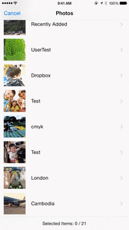
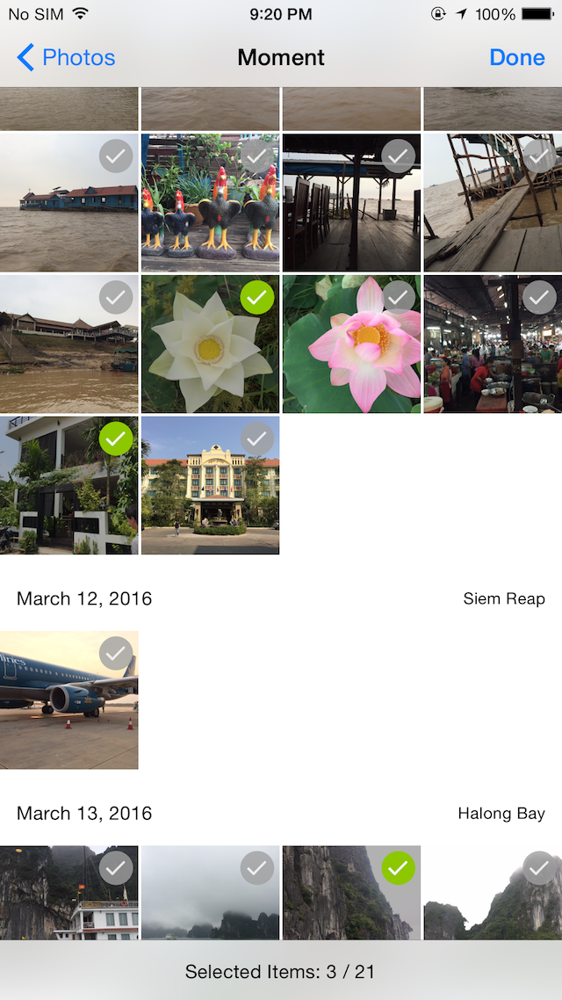

<p align="center"></p>

## Description

### Multiple image picker for iOS app.

NohanaImagePicker enables your app to pick images from multiple album, and the moment.

 

## Usage

```swift
import UIKit
import Photos
import NohanaImagePicker
class MyViewController: UIViewController {
    let picker = NohanaImagePickerController()

#     override func viewDidAppear(_ animated: Bool) {
        super.viewDidAppear(animated)
        self.picker.delegate = self
        present(self.picker, animated: true, completion: nil)
    }
}

extension MyViewController: NohanaImagePickerControllerDelegate {

    func nohanaImagePickerDidCancel(_ picker: NohanaImagePickerController) {
        print("🐷Canceled🙅")
        picker.dismiss(animated: true, completion: nil)
    }

    func nohanaImagePicker(_ picker: NohanaImagePickerController, didFinishPickingPhotoKitAssets pickedAssts :[PHAsset]) {
        print("🐷Completed🙆\n\tpickedAssets = \(pickedAssts)")
        picker.dismiss(animated: true, completion: nil)
    }
}
```

### Customize

```swift
let picker = NohanaImagePickerController()

// Set the maximum number of selectable images
picker.maximumNumberOfSelection = 21

// Set the cell size
picker.numberOfColumnsInPortrait = 2
picker.numberOfColumnsInLandscape = 3

// Show Moment
picker.shouldShowMoment = true

// Show empty albums
picker.shouldShowMoment = shouldShowEmptyAlbum = true

// Hide toolbar
picker.shouldShowEmptyAlbum = true

// Disable to pick asset
picker.canPickAsset = { (asset:Asset) -> Bool in
    return false
}
```

## Requirements

- Swift 2.2 later
- iOS 8.0 later

## Installation

### Carthage (preferable)

Use [Carthage](https://github.com/Carthage/Carthage).

- Add `github "nohana/NohanaImagePicker"` to your Cartfile.
  - If you want to use Swift3.0, add `github "nohana/NohanaImagePicker", "0.8.0"` instead.
  - If you want to use Swift2.3, add `github "nohana/NohanaImagePicker", "0.6.1"` instead.
  - If you want to use Swift2.2, add `github "nohana/NohanaImagePicker", "0.5.0"` instead.
- Run `carthage update`.

### Framework with CocoaPods

Use [CocoaPods](https://cocoapods.org/).

- Try; ``pod try NohanaImagePicker``

- Add the followings to your Podfile:

```ruby
use_frameworks!
pod "NohanaImagePicker"
```

- If you want to use Swift2.3 write `pod "NohanaImagePicker",  "0.6.1"` instead of `pod "NohanaImagePicker"`.

- Run `pod install`.

## License

This library is licensed under Apache License v2.

```
Copyright (C) 2016 nohana, Inc. All rights reserved.

Licensed under the Apache License, Version 2.0 (the "License"); you may not use
this file except in compliance with the License. You may obtain a copy of the
License at

    http://www.apache.org/licenses/LICENSE-2.0

Unless required by applicable law or agreed to in writing, software distributed
under the License is distributed on an "AS IS" BASIS, WITHOUT WARRANTIES OR
CONDITIONS OF ANY KIND, either express or implied. See the License for the
specific language governing permissions and limitations under the License.
```
